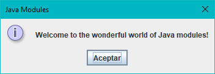
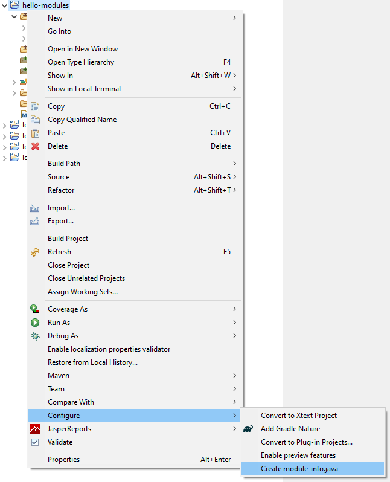

# Hello Modules

Our first modular Java application. 



## Create the project

Generate a new simple Maven project from the command line:

```bash
mvn archetype:generate \
    -DarchetypeGroupId=org.apache.maven.archetypes \ 
    -DarchetypeArtifactId=maven-archetype-quickstart
    -DgroupId=modules.workshop.hello \
    -DartifactId=hello-modules \
    -Dversion=1.0.0
```

Or just create a new Maven project with your favourite IDE.

## Set up the POM

Set Java version to 17 (or at least 9+) and source code encoding to UTF-8:

```xml
<properties>
    <project.build.sourceEncoding>UTF-8</project.build.sourceEncoding>
    <maven.compiler.source>17</maven.compiler.source>
    <maven.compiler.target>17</maven.compiler.target>
</properties>
```

Set `maven-compiler-plugin`to version 3.8 (for compiling Java module descriptors):

```xml
<plugin>
    <groupId>org.apache.maven.plugins</groupId>
    <artifactId>maven-compiler-plugin</artifactId>
    <version>3.8.0</version>
</plugin>
```

Add `maven-jar-plugin` to create a runnable JAR:

```xml
<plugin>
    <groupId>org.apache.maven.plugins</groupId>
    <artifactId>maven-jar-plugin</artifactId>
    <version>3.2.2</version>
    <configuration>
        <archive>
            <manifest>
                <mainClass>modules.workshop.hello.HelloModules</mainClass>
            </manifest>
        </archive>
    </configuration>
</plugin>
```

## Create the main class

Create the `HelloModules` main class which just shows a dialog in the GUI using Swing API:

```java
package modules.workshop.hello;

import javax.swing.JOptionPane;

public class HelloModules {

    public static void main(String[] args) {
        // show a dialog 
        JOptionPane.showMessageDialog(
                null, 
                "Welcome to the wonderful world of Java modules!", // dialog mesage 
                "Java Modules", // dialog title 
                JOptionPane.INFORMATION_MESSAGE // dialog type
            );
    }

}
```

## Create the module descriptor: `module-info.java`

Create the file `module-info.java` in the root package of the module:

```java
module hello.modules {    
    requires java.desktop;
}
```

`java.desktop` module is required for using all related desktop stuff (AWT, Swing, ...).`java.base` module is always implicitly required by all modules, so we don't need to require it explicitly.

> **Eclipse tip**: you can generate this file from **Project context menu** > **Configure** > **Create module-info.java** in Eclipse.
> 
> 

## Package the app

Compile and package the project:

```bash
mvn clean package
```

## Run the app

#### Modular

Run a module's main class specified in its`MANIFEST.MF` file, just specifying the module name (`hello-modules` module is inside a runnable JAR):

```bash
java \
    --module-path target/hello-modules-1.0.0.jar \
    --module hello.modules
```

 `hello-module`'s classes will be loaded as a module, checking its dependencies on other modules (system or third party modules), and hiding internal classes (non exported nor opened) to other modules.

Or using a main class different from the specified in the `MANIFEST.MF` file:

```bash
java \
    --module-path target/hello-modules-1.0.0.jar \
    --module hello.modules/modules.workshop.hello.HelloModules
```

#### Non-modular (legacy)

Run the application in legacy mode (non-modular):

```bash
java \
    --class-path target/hello-modules-1.0.0.jar \
    modules.workshop.hello.HelloModules
```

 `hello-module`'s classes will be loaded as a bunch of classes in the **unnamed module**, with full access to other classes in the unnamed module and to the exported classes of other modules (system or third party modules) and full access using reflection to opened ones.

## Print module description

Show a JAR file module description:

```bash
jar --describe-module --file=target/hello-modules-1.0.0.jar
```

Show a system module description:

```bash
java --describe-module java.desktop
```

List all available system modules to the JVM:

```bash
java --list-modules
```

## Discover modules

Print a comma separated list with all the modules our app depends on:

```bash
jdeps \
    --multi-release 17 \
    --ignore-missing-deps \
    --print-module-deps \
    --module-path target/hello-modules-1.0.0.jar \
    --module hello.modules
```

In our case, it will show:

```bash
java.base,java.desktop
```

> The output format of the `--print-module-deps` argument is prepared for use directly with `jlink`.

## Create a custom Java runtime image

Create a reduced runtime image specifically created for this application with a launcher script (`hello`):

```bash
jlink \
    --compress=2 \
    --no-header-files \
    --no-man-pages \
    --strip-debug \
    --module-path target/hello-modules-1.0.0.jar \
    --add-modules hello.modules \
    --output target/runtime \
    --launcher hello=hello.modules/modules.workshop.hello.HelloModules
```

> In this case, our module is merged into the JVM, available as an additional module, so, there is no need to specify where is our module when running the JVM.

#### Run the app

Using the generated launcher:

```bash
$ ./target/runtime/bin/hello
```

Or the `java` command:

```bash
$ ./target/runtime/bin/java --module hello.modules
```

#### List modules in customized runtime image

Next command prints the list of modules included in the generated runtime:

```bash
$ ./target/runtime/bin/java --list-modules
hello.modules
java.base@17.0.3
java.datatransfer@17.0.3
java.desktop@17.0.3
java.prefs@17.0.3
java.xml@17.0.3
```