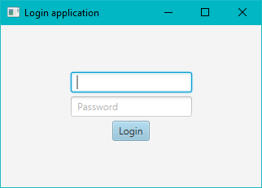
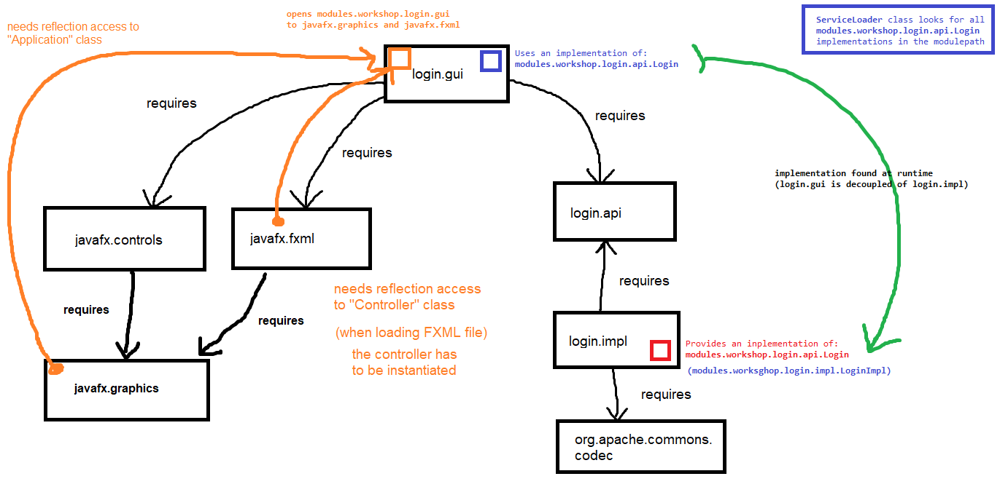

# Login App with Services and GUI

JavaFX application for users to login. It checks if a provided user credentials are valid or not, asking to a login service.



This is a multi-module Maven project with the next Java module projects inside:

- **login-service-api** (module name: `login.api`): Login service interface, which has to be implemented.

- **login-service-impl** (module name: `login.impl`): Login service interface implementation. This login service stores users in a `passwd` resource file. User passwords' are hashed (so, this project depends on the `commons-codec` library).

- **login-gui** (module name: `login.gui`): This is the root module, containing the main class. It uses JavaFX to show a windows where user credentials are asked to the user and consumes the login service implementation to validate them.



The login service implementation and the GUI are totally decoupled.

## Build the app

Run next command in the parent project:

```bash
mvn clean package
```

## Run the app

Change to the root module project output directory:

```bash
cd login-gui/target
```

A run the application using the module path argument (as a Java modular app):

```bash
java \
    --module-path libs:login-gui-1.0.0.jar \
    --module login.gui
```

> `login-gui` module is inside a runnable JAR, so there is no need to specify the main class.

## Generate a custom Java runtime image

Use `jdeps` first to find only system modules needed by our app:

```bash
jdeps \
    --multi-release 17 \
    --ignore-missing-deps \
    --print-module-deps \
    --module-path libs:login-gui-1.0.0.jar \
    libs/*.jar login-gui-1.0.0.jar \
    | grep -v ^Warning
```

And then generate a custom runtime image only the modules found (`java.base,java.desktop,java.scripting,jdk.jfr,jdk.unsupported`):

```bash
jlink \
    --compress=2 \
    --no-header-files \
    --no-man-pages \
    --strip-debug \
    --add-modules java.base,java.desktop,java.scripting,jdk.jfr,jdk.unsupported \
    --output runtime
```

One the runtime is generated, we can run our application:

```bash
./runtime/bin/java \
    --module-path libs:login-gui-1.0.0.jar \
    --module login.gui
```
