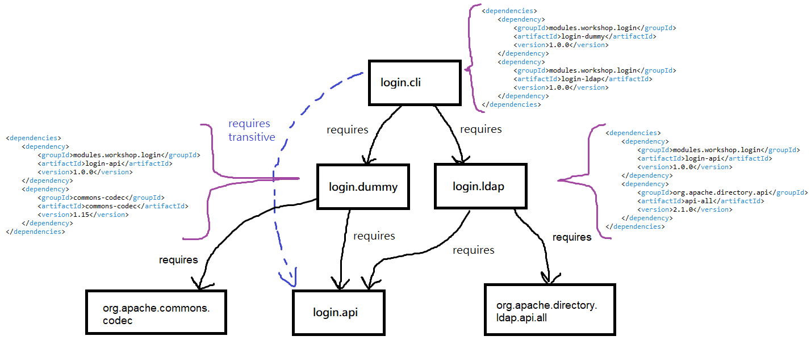

# Login App

Simple console application for users to login. It checks if a provided user credentials are valid or not, asking to two different login services: **dummy** (user credentials stored in a `passwd` resource file) and **LDAP** (users stored in [JumpCloud](https://jumpcloud.com/) LDAP server).

```bash
Enter username: jchan
Enter password: ****
jchan is logged in!
```

This is a multi-module Maven project with the next Java module projects inside:

- **login-api** (module name: `login.api`): Login service interface, which has to be implemented.

- **login-dummy** (module name: `login.dummy`): Login service interface implementation. This login service stores users in a `passwd` resource file. User passwords' are hashed (so, this project depends on the `commons-codec` library).

- **login-ldap** (module name: `login.ldap`): Another login service interface implementation. This service uses user credentials stored in an LDAP server (so, this project depends on the `apache-directory-ldap` library).

- **login-cli** (module name: `login.cli`): This is the root module, containing the main class. It asks in the console for user credentials and consumes the login services to validate them.



## Build the app

Run next command in the parent project:

```bash
mvn clean package
```

## Run the app

Change to the root module project output directory:

```bash
cd login-cli/target
```

Using the module path argument (as a Java modular app):

```bash
java \
    --module-path libs:login-cli-1.0.0.jar \
    --module login.cli
```

> `login-cli` module is inside a runnable JAR, so there is no need to specify the main class.

Or using the class path argument (legacy mode), loading all our classes in the **unnamed module**:

```bash
java \
    --class-path libs/*:login-cli-1.0.0.jar \
    modules.workshop.login.cli.Main
```

## Generate a custom Java runtime image

If we try to generate a custom runtime image in the next way, it fails:

```bash
$ jlink \
    --compress=2 \
    --no-header-files \
    --no-man-pages \
    --strip-debug \
    --module-path libs:login-cli-1.0.0.jar \
    --add-modules login.cli \
    --output runtime
Error: automatic module cannot be used with jlink: org.apache.servicemix.bundles.antlr from .../java-modules/login-app/login-cli/target/libs/org.apache.servicemix.bundles.antlr-2.7.7_5.jar
```

This happens because automatic modules can not be embedded in the generated custom image. As it is a bit hard to generate a custom runtime choosing only explicit modules, we are going to use `jdeps` first to find only system modules needed by our app:

```bash
jdeps \
    --multi-release 17 \
    --ignore-missing-deps \
    --print-module-deps \
    --module-path libs:login-cli-1.0.0.jar \
    libs/*.jar login-cli-1.0.0.jar \
    | grep -v ^Warning
```

And then generate a custom runtime image only the modules found (`java.base,java.desktop,java.logging,java.management,java.naming,java.security.jgss,java.security.sasl`):

```bash
jlink \
    --compress=2 \
    --no-header-files \
    --no-man-pages \
    --strip-debug \
    --add-modules java.base,java.desktop,java.logging,java.management,java.naming,java.security.jgss,java.security.sasl \
    --output runtime
```

One the runtime is generated, we can run our application with the next script (`login-cli.sh`):

```bash
#!/usr/bin/env bash
SCRIPTPATH=$(dirname $(readlink -f "$0"))
"$SCRIPTPATH/runtime/bin/java" \
    --module-path libs:login-cli-1.0.0.jar \
    --module login.cli
```

> Don't forget to `chmod +x login-cli.sh`.

## Create a distributable

Finally, we can create a directory including all our app artifacts, and distribute it:

```bash
$ mkdir login-cli
$ mv libs login-cli
$ mv login-cli-1.0.0.jar login-cli
$ mv login-cli.sh login-cli
$ mv runtime login-cli
$ cd login-cli
$ ls -l
total 8
drwxrwxrwx 1 fvarrui fvarrui 4096 Jun  6 00:28 libs
-rwxrwxrwx 1 fvarrui fvarrui 4165 Jun  6 00:29 login-cli-1.0.0.jar
-rwxrwxrwx 1 fvarrui fvarrui  109 Jun  6 00:29 login-cli.sh
drwxrwxrwx 1 fvarrui fvarrui 4096 Jun  6 00:29 runtime
$ ./login-cli.sh
Enter username: jchan
Enter password: kick
jchan is logged in!
```
